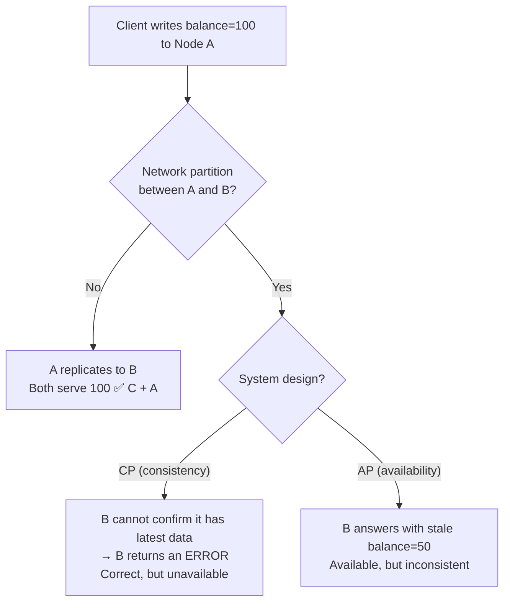

# The CAP Theorem

> **Difficulty:** 🟡 Intermediate
> **Estimated reading time:** ~22 minutes
> **Prerequisites:** A basic mental model of a distributed system (multiple machines, called *nodes*, cooperating over a network to serve requests). Familiarity with the idea that networks can drop or delay messages. No formal proof background required.

---

## Learning objectives

By the end of this chapter you will be able to:

- [ ] State the CAP theorem precisely, using the real definitions of Consistency, Availability, and Partition tolerance (not the folklore versions).
- [ ] Explain *why* partition tolerance is not optional for any real distributed system, and what the choice between C and A actually means.
- [ ] Classify real databases (PostgreSQL, DynamoDB, MongoDB, Cassandra, ZooKeeper) as CP or AP and justify the classification.
- [ ] Recognize the common misconceptions that make CAP misleading, and reach for PACELC when CAP is too coarse.
- [ ] Make a deliberate consistency-vs-availability decision for a feature you are designing.

---

## TL;DR

The CAP theorem says that when a network **partition** (P) splits your distributed system into groups that cannot talk to each other, you must choose between **consistency** (C — every read sees the latest write) and **availability** (A — every request gets a non-error response). You cannot have both *during a partition*. Because partitions are unavoidable on real networks, the practical question is never "CA, CP, or AP?" but rather "when the network breaks, do we refuse requests to stay correct (CP), or answer with possibly-stale data to stay up (AP)?" The one thing to remember: **CAP is a statement about behavior during failures, not a permanent label on your database.**

---

## 1. The problem this solves

Imagine you run a simple key-value store on a single machine. A client writes `balance = 100`, and every subsequent read returns `100`. Simple, correct, boring.

Now your traffic grows. One machine can't hold the data or serve the load, and if it dies you lose everything. So you run **three replicas** of the data on three machines in different racks. This buys you durability and scale — but it creates a new, deep problem: **the replicas can disagree.**

Suppose a client writes `balance = 100` to replica A. Before A can copy that write to replicas B and C, the network link between racks fails. Now:

- A client talking to **A** would see `balance = 100`.
- A client talking to **B** would see the old value (say `balance = 50`).

The system has to decide, *right now*, with no ability to coordinate:

1. **Refuse to answer** on B and C until the network heals, so nobody ever sees stale data (choosing **consistency**), or
2. **Answer with the stale `50`** so the system stays responsive (choosing **availability**).

There is no third option that gives you both fresh data *and* a guaranteed answer while the link is down. The CAP theorem is the formal statement of exactly this dilemma. It tells you that this tradeoff is fundamental — not a limitation of your engineering, but a law of distributed systems.

---

## 2. Core concepts

The CAP theorem was conjectured by Eric Brewer in 2000 and proved formally by Seth Gilbert and Nancy Lynch in 2002. The three letters are precise technical terms. Most confusion about CAP comes from using their everyday meanings instead.

### C — Consistency

In CAP, "consistency" means **linearizability** (also called *atomic* or *strong* consistency). The system behaves as if there is a single, up-to-date copy of the data: once a write completes, every subsequent read — on *any* node — returns that write or a later one. There is a single global order of operations consistent with real time.

> ⚠️ This is **not** the "C" in ACID. ACID's Consistency is about preserving database invariants within a transaction (e.g., a foreign-key constraint). CAP's Consistency is about all replicas agreeing on the current value. They are unrelated concepts that unfortunately share a word.

### A — Availability

Every request received by a **non-failing** node must result in a **non-error response** — in a finite time. The response is allowed to be slow, but it cannot be an error or a timeout-forever. Crucially, the definition says nothing about the response being *correct* or *fresh* — only that you get an answer.

> Note the subtlety: a node that has crashed is excused. Availability is about working nodes still answering.

### P — Partition tolerance

The system continues to operate despite an arbitrary number of messages being dropped or delayed between nodes. A **partition** is when the network splits the cluster into groups that can't communicate.

```
   Healthy cluster                  Partitioned cluster
   ----------------                 -------------------

      [A]---[B]                        [A]   ||   [B]
       \   /                            |    ||    |
        [C]                            [C]   ||   (B isolated)
                                             ||
   all nodes can talk            "||" = network split: messages
                                  between the two sides are lost
```

*The diagram shows a three-node cluster, first fully connected, then split by a partition so that node B cannot exchange messages with A and C.*

### Why "pick 2 of 3" is the wrong framing

The popular "CAP = pick 2 of 3" triangle is misleading. Here's the key insight that fixes it:

**Partition tolerance is not a choice.** On any real network — Ethernet, the public internet, even within a single datacenter — packets get dropped, switches reboot, cables get unplugged, and garbage-collection pauses make a node *look* unreachable. Partitions *will* happen. A system that is not partition-tolerant simply *breaks* (corrupts data or hangs) when a partition occurs, which is not an option for production.

So you don't get to "drop P." You must tolerate partitions. The real theorem reduces to:

> **When (not if) a partition happens, you must choose between Consistency and Availability.**

```
                         Is there a partition right now?
                                     |
                  +------------------+------------------+
                  | NO                                  | YES
                  v                                     v
        You can have BOTH                     You MUST choose:
        C and A.                              +------------------+
        (CAP says nothing                     |  CP: stay        |
         about the                            |  consistent,     |
         no-failure case.)                    |  refuse some     |
                                              |  requests        |
                                              +------------------+
                                              |  AP: stay        |
                                              |  available,      |
                                              |  serve stale     |
                                              |  data            |
                                              +------------------+
```

*The decision only bites during a partition. When the network is healthy, a well-designed system provides both consistency and availability.*

### The choice, visualized



*During a partition, a CP system sacrifices availability on the minority side to avoid serving stale or conflicting data; an AP system keeps answering everywhere but may return stale data and reconcile later.*

---

## 3. How it works in depth

### CP systems: consistency over availability

A CP system refuses to serve requests it cannot guarantee are correct. The standard mechanism is a **quorum** built on **majority voting**.

Suppose 5 nodes. A write or read requires acknowledgement from a **majority (3)**. When a partition splits the cluster into a group of 3 and a group of 2:

- The **majority side (3 nodes)** can still form a quorum → it stays available *and* consistent.
- The **minority side (2 nodes)** cannot reach a quorum → it **rejects requests** (becomes unavailable) rather than risk diverging.

```
5-node CP cluster, partitioned 3 | 2

   Majority side (quorum = 3)        Minority side
   +-----+ +-----+ +-----+           +-----+ +-----+
   | N1  | | N2  | | N3  |    ||      | N4  | | N5  |
   +-----+ +-----+ +-----+    ||      +-----+ +-----+
   Can elect a leader,        ||      Cannot reach quorum,
   accept writes/reads        ||      returns errors
   → AVAILABLE + CONSISTENT   ||      → UNAVAILABLE (on purpose)
```

*With majority quorums, at most one side of any partition can hold a majority, so only one side stays writable. This is how CP systems guarantee they never have two "truths" at once.*

This is exactly how consensus protocols like **Raft** and **Paxos** work, and it's why systems built on them (etcd, ZooKeeper, Consul) are CP. The price: if you're on the minority side, or if no side has a majority (e.g., a 3-way split), you get errors.

### AP systems: availability over consistency

An AP system always answers, even when isolated. Each node serves from its local copy and accepts writes locally. When the partition heals, the divergent copies must be **reconciled**. Common reconciliation strategies:

- **Last-write-wins (LWW):** keep the write with the highest timestamp. Simple, but silently discards concurrent writes — and depends on clock accuracy.
- **Version vectors / vector clocks:** detect concurrent writes and surface conflicts (Dynamo, Riak).
- **CRDTs (Conflict-free Replicated Data Types):** data structures designed to merge automatically without conflict (used in Redis CRDTs, Riak, collaborative editors).
- **Application-level merge:** hand both versions to the application to resolve (the classic Amazon shopping-cart example merges the carts, which is why a deleted item could reappear).

The price: clients can read **stale data**, and you must design for **eventual consistency** — the guarantee that, *given no new writes*, all replicas eventually converge to the same value.

### Where did "CA" go?

The "CA" corner of the triangle (consistency + availability, no partition tolerance) describes a **single-node** system, or a system that simply has no answer when the network breaks. A single PostgreSQL instance is "CA" in the trivial sense — but the moment you replicate it across machines, you're back to choosing CP or AP during a partition. **In practice, no useful distributed system is "CA."** Treat CA as a non-option.

### CAP is not all-or-nothing per system

Modern systems make the choice **per-operation** or **per-data-type**, not once for the whole database:

- **Cassandra** lets you choose a consistency level *per query* (`ONE`, `QUORUM`, `ALL`), sliding between AP and CP.
- **MongoDB** is CP by default (reads/writes go to the primary) but offers tunable read/write concerns.
- **Cosmos DB** exposes five named consistency levels (strong → eventual) you select per request.

So the honest classification is often "this system *defaults* to CP/AP, and lets you tune individual operations."

---

## 4. Real production examples

**Amazon DynamoDB (and its Dynamo paper ancestor) — AP-leaning.** Amazon's shopping cart famously prioritized availability: a customer must *always* be able to add to their cart, even during failures, because a failed "add to cart" is lost revenue. Carts could temporarily diverge across replicas and were merged on read. DynamoDB today offers eventually consistent reads by default (cheaper, always available) and strongly consistent reads as an opt-in (which can fail during partitions) — CAP as a per-request knob.

**etcd / ZooKeeper / Consul — CP.** These store critical coordination state: Kubernetes object state (etcd), service configuration, leader election, distributed locks. For these, serving stale data is dangerous — two services both believing they hold the same lock could corrupt data. So they use Raft/ZAB consensus and **become unavailable on the minority side of a partition** rather than risk inconsistency. Kubernetes' control plane stops accepting changes if etcd loses quorum.

**Apache Cassandra — AP, tunable.** Originally designed at Facebook for the inbox search feature, Cassandra defaults to high availability and eventual consistency, and is used where uptime trumps strict freshness (e.g., Netflix's viewing data, Discord's message storage). But its per-query consistency levels let you demand `QUORUM` reads and writes, which together (`R + W > N`) give you strong consistency at the cost of availability during partitions.

**Google Spanner — "effectively CA," really CP.** Spanner provides external consistency (linearizability) globally using synchronized clocks (TrueTime) and Paxos. Google argues it is "effectively CA" *in practice* because Google's private network has such low partition rates — but Spanner is fundamentally **CP**: during the rare partition, it chooses consistency and the minority side becomes unavailable. This is a great illustration that the *probability* of partitions, not just the theoretical choice, drives real architecture.

---

## Advantages

Understanding CAP well gives you:

- ✅ **A precise vocabulary** for reasoning about failure behavior, which is what distinguishes senior design discussions from buzzword bingo.
- ✅ **A forcing function** to decide *up front* what your system does during a partition, instead of discovering it during an outage.
- ✅ **A lens for choosing datastores:** matching the C/A bias of a database to the needs of the data it holds (money → CP; "who's online" → AP).

## Disadvantages

The CAP *framework itself* has real limitations:

- ❌ **It's binary and absolute.** Real systems aren't purely C or A; they're "mostly consistent with occasional staleness measured in milliseconds." CAP can't express that nuance.
- ❌ **It only describes the partition case.** It says nothing about the far more common situation: a healthy network where the real tradeoff is **latency vs consistency**. (PACELC fixes this — see below.)
- ❌ **"Availability" in CAP is a strict, theoretical definition** (every non-failing node answers). Real "high availability" (99.99% uptime) is a statistical/operational property that CAP doesn't directly measure.
- ❌ **It invites mislabeling.** Calling a system "CA" or saying you "chose CP" hides that the choice is often per-operation and configurable.

## Tradeoffs

| Decision | You gain | You give up |
|----------|----------|-------------|
| **Choose CP** (e.g., quorum reads/writes, Raft) | Reads never return stale data; no conflicts to reconcile; simpler application logic | Some requests error out during partitions; minority side goes dark; usually higher write latency (must reach a majority) |
| **Choose AP** (e.g., local reads, async replication) | The system always answers; survives partitions and node loss gracefully; lower latency | Clients may read stale data; you must design conflict resolution; harder application reasoning |
| **Tune per-operation** (Cassandra/Cosmos style) | Right tool per use case in one system | Operational complexity; easy to misconfigure into an unexpected mode |
| **Stronger consistency in general** | Correctness, easier reasoning | Higher latency (coordination), lower availability under failure |

---

## Common interview questions

1. **Q:** Can a distributed system be CA (consistent and available but not partition-tolerant)? <br> **A:** Not in any practically useful sense. Partitions are a fact of real networks, so a distributed system *must* tolerate them. "CA" really only describes a single-node system. The meaningful choice for any distributed system is CP vs AP *during a partition*.

2. **Q:** Does choosing CP mean the system is always unavailable, and AP means always inconsistent? <br> **A:** No. The tradeoff only applies *during a partition*. When the network is healthy, a CP system is fully available and an AP system can be fully consistent. CAP is a statement about behavior under failure, not steady state.

3. **Q:** Is the "C" in CAP the same as the "C" in ACID? <br> **A:** No — this is a classic trap. CAP's C is *linearizability* (all replicas agree on the latest value). ACID's C is *invariant preservation* within a transaction (constraints, referential integrity). They share a letter and nothing else.

4. **Q:** You're designing a banking system that moves money between accounts. CP or AP? <br> **A:** CP for the ledger/balance: serving a stale balance could allow double-spending, which is unacceptable. You'd accept that some operations fail or slow down during partitions. You might still use AP components for non-critical paths (e.g., showing a "recent activity" feed), demonstrating that the choice is per-data, not global.

5. **Q:** How do quorums let a CP system stay available on one side of a partition? <br> **A:** By requiring a majority for reads and writes. A partition can leave a majority on at most one side, so only that side can make progress; the minority side rejects requests. This guarantees there's never more than one "active truth," preserving consistency.

6. **Q:** What does CAP *not* tell you, and what extends it? <br> **A:** CAP is silent about the normal, no-partition case, where the real tension is latency vs consistency. **PACELC** extends CAP to cover this: *if Partition then choose Availability or Consistency, Else choose Latency or Consistency.*

## Common misconceptions

- ❌ **Misconception:** "You pick 2 of the 3 — CA, CP, or AP." <br> ✅ **Reality:** You can't give up P in a real distributed system. The genuine choice is C vs A, and only *during* a partition. CA is not a real option.

- ❌ **Misconception:** "CAP means a CP system is unavailable and an AP system is inconsistent, all the time." <br> ✅ **Reality:** The tradeoff is only forced *while a partition is happening*. Healthy networks give you both.

- ❌ **Misconception:** "CAP's Consistency is the same as ACID's Consistency." <br> ✅ **Reality:** Different concepts. CAP = linearizability across replicas; ACID = invariant preservation in a transaction.

- ❌ **Misconception:** "A database is permanently CP or AP." <br> ✅ **Reality:** Many systems let you choose per operation (consistency levels, read/write concerns). A single database can behave CP for one query and AP for another.

- ❌ **Misconception:** "AP means data is just wrong / lost." <br> ✅ **Reality:** AP systems aim for *eventual consistency* — replicas converge once the partition heals, using version vectors, CRDTs, or merge logic. Staleness is temporary, not permanent corruption (if designed well).

## Practical implementation advice

- **Start from the data, not the database.** Different data has different needs. Money, inventory counts, and locks usually want CP. Likes, view counts, presence ("who's online"), and feeds usually tolerate AP. Don't force one choice across the whole system.
- **Ask "what happens during a partition?" explicitly in design reviews.** If nobody on the team can answer, you have an AP-by-accident system — it will serve stale data under failure whether you intended it or not.
- **Prefer CP for anything where two conflicting truths cause real damage** (financial ledgers, unique-username assignment, distributed locks). Use battle-tested consensus systems (etcd, ZooKeeper) rather than rolling your own quorum logic.
- **For AP, decide your conflict-resolution strategy before launch, not after.** "Last write wins" is tempting but silently drops data and depends on synchronized clocks. Prefer CRDTs or explicit merges for anything you can't afford to lose.
- **Reach for PACELC when CAP feels too coarse.** In healthy operation (the 99.9% case), you're usually trading **latency** for consistency, e.g., "do I wait for all replicas to ack (slow, consistent) or one (fast, possibly stale)?" PACELC names this; CAP ignores it.
- **Measure your actual partition rate.** Spanner's "effectively CA" stance works because Google's network rarely partitions. Your tradeoff math changes if partitions are common (multi-region over the public internet) vs rare (single AZ, redundant links).

---

## Summary

- The CAP theorem: during a network **partition**, you must choose between **Consistency** (linearizable, always-fresh reads) and **Availability** (every working node answers). You cannot have both while partitioned.
- **Partition tolerance is mandatory** for real distributed systems, so "pick 2 of 3" is misleading. The real choice is **CP vs AP, and only during a partition.**
- **CP** systems (etcd, ZooKeeper, Spanner, default MongoDB) refuse requests on the minority side to stay correct. **AP** systems (Dynamo, Cassandra by default) keep answering and reconcile later.
- CAP's "C" ≠ ACID's "C". CAP says nothing about the no-partition case — use **PACELC** for the latency-vs-consistency tradeoff during normal operation.
- The practical discipline: choose C vs A **per data type / per operation**, decide it **before** the outage, and for AP pick your **conflict resolution** up front.

## References

- [Brewer, E. — "Towards Robust Distributed Systems" (PODC 2000 keynote)](https://people.eecs.berkeley.edu/~brewer/cs262b-2004/PODC-keynote.pdf) — the original CAP conjecture.
- [Gilbert, S. & Lynch, N. — "Brewer's Conjecture and the Feasibility of Consistent, Available, Partition-Tolerant Web Services" (2002)](https://groups.csail.mit.edu/tds/papers/Gilbert/Brewer2.pdf) — the formal proof.
- [Brewer, E. — "CAP Twelve Years Later: How the 'Rules' Have Changed" (IEEE Computer, 2012)](https://www.infoq.com/articles/cap-twelve-years-later-how-the-rules-have-changed/) — Brewer revisiting and correcting the folklore.
- [DeCandia et al. — "Dynamo: Amazon's Highly Available Key-value Store" (SOSP 2007)](https://www.allthingsdistributed.com/files/amazon-dynamo-sosp2007.pdf) — the canonical AP system design.
- [Corbett et al. — "Spanner: Google's Globally-Distributed Database" (OSDI 2012)](https://research.google/pubs/pub39966/) — the "effectively CA" CP system.
- [Abadi, D. — "Consistency Tradeoffs in Modern Distributed Database System Design" (PACELC, IEEE Computer 2012)](https://www.cs.umd.edu/~abadi/papers/abadi-pacelc.pdf) — the extension that covers the no-partition case.
- [Kleppmann, M. — *Designing Data-Intensive Applications*, Ch. 9](https://dataintensive.net/) — excellent critique of CAP and a rigorous treatment of consistency models.

**Related chapters:** PACELC (`09-consistency-and-consensus/pacelc.md`), Consistency Models (`09-consistency-and-consensus/consistency-models.md`), Replication (`10-replication/`), Distributed Systems Fundamentals (`08-distributed-systems/`) — *coming as the handbook grows.*
