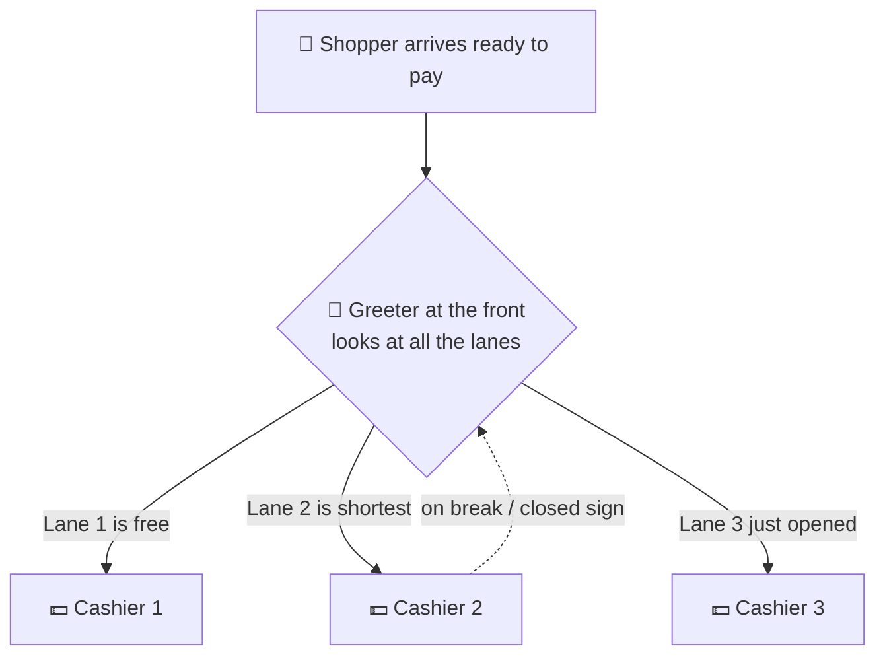
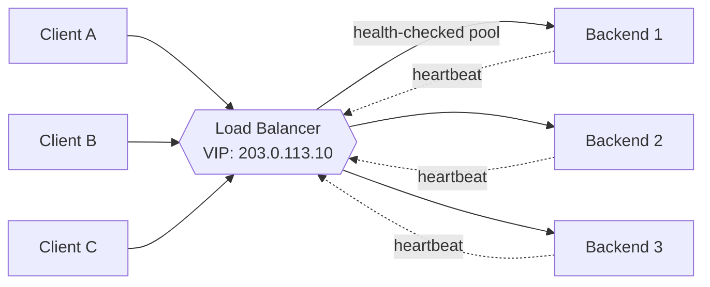
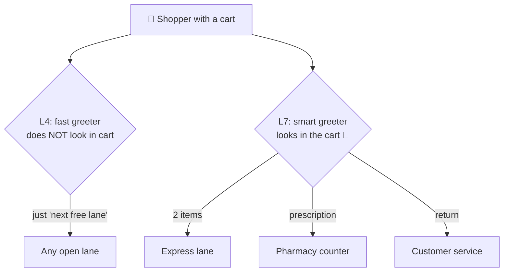
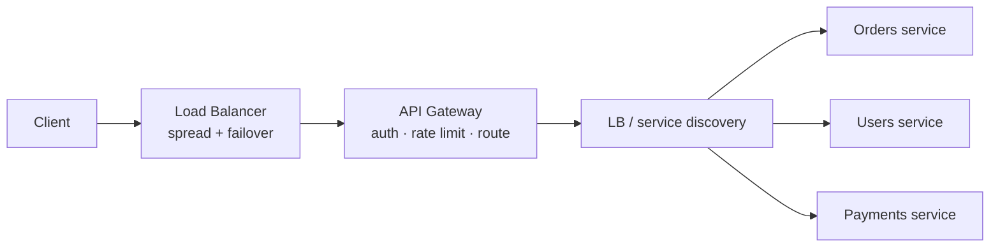
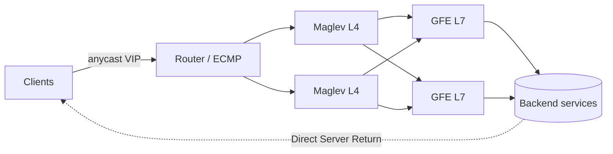

# Load Balancers

> **Difficulty:** 🟡 Intermediate
> **Estimated reading time:** ~18 minutes
> **Prerequisites:** Basic understanding of client–server communication over a network, what an IP address and a TCP connection are, and the rough idea that web traffic uses HTTP. No prior distributed systems background required.

---

## First, an everyday analogy (no tech required)

Picture a busy **supermarket on a Saturday afternoon**.

Hundreds of shoppers finish at the same time and head for the checkout. If there were only **one cashier**, the line would stretch to the back of the store, the cashier would burn out, and if that one cashier went on break, *checkout would stop completely*. That single cashier is a website running on **one server** — it works fine until it gets popular, and then everyone suffers.

So the store hires **many cashiers**, and — this is the important part — puts a friendly **greeter at the front of the lanes** whose only job is to look at all the lines and say *"You there — lane 3 is free, go!"*

That greeter is a **load balancer**.

```
        ONE cashier (no load balancer)        MANY cashiers + a greeter (load balancer)
        ------------------------------        -----------------------------------------

           🧍 🧍 🧍 🧍 🧍 🧍 🧍                          🧍🧍🧍🧍🧍🧍🧍
                  |                                          |
                  v                                   👋  "Lane 3 is open!"
               [ 💵 ]   <- one tired cashier         (the greeter = load balancer)
              one long line,                          /        |        \
              everyone waits,                    [ 💵 ]      [ 💵 ]      [ 💵 ]
              break = store closed              cashier 1   cashier 2   cashier 3
                                               short lines, nobody waits long,
                                               one on break? others keep going
```

*The shoppers are **requests** from users. The cashiers are your **servers**. The greeter who directs each shopper to a free lane is the **load balancer**. No single cashier gets crushed, and if one steps away the line keeps moving.*

Now notice how naturally the real concepts fall out of this one picture:

| In the supermarket… | …in a real system | The technical term |
|----------------------|-------------------|--------------------|
| A shopper ready to pay | A user's request | **Request / client** |
| A cashier | One server | **Backend / server** |
| The greeter at the front | The thing spreading the work | **Load balancer** |
| "Go to the next lane in order" | Rotate through servers evenly | **Round robin** |
| "Go to the shortest line" | Pick the least-busy server | **Least connections** |
| "Cash only → lane 1, Card → lane 2" | Send certain requests to certain servers | **Layer 7 (content-based) routing** |
| Cashier puts up a "closed" sign | Server is down, stop sending to it | **Health check** |
| "Always use the *same* cashier who knows your coupons" | Keep a user pinned to one server | **Sticky session** |
| What if the *greeter* faints? | The director itself fails | **LB is a single point of failure** |

That last row is the punchline beginners miss: if the **greeter faints**, the whole front of the store jams even though every cashier is fine. So smart stores keep a **second greeter ready to step in**. In systems, you *always run a backup load balancer* for exactly this reason.



*The greeter (load balancer) checks every lane before sending each shopper, and notices when a cashier puts up a "closed" sign so nobody is sent to an empty lane.*

Keep this supermarket in your head for the rest of the chapter — every technical term below maps back to it.

---

## Learning objectives

By the end of this chapter you will be able to:

- [ ] Explain what a load balancer (LB) is and the concrete problems it solves in a high-level design.
- [ ] Distinguish Layer 4 (transport) from Layer 7 (application) load balancing and choose between them.
- [ ] Compare the common load-balancing algorithms and pick one for a given workload.
- [ ] Reason about health checks, session stickiness, TLS termination, and high availability of the LB itself.
- [ ] Place load balancers correctly in a system design diagram and defend the choice in an interview.

---

## TL;DR

A load balancer is a component that sits in front of a pool of servers and distributes incoming requests across them. It exists to give you **horizontal scalability** (add more servers to handle more traffic) and **high availability** (route around failed servers). The two big decisions are *what layer it operates at* — **L4** (fast, connection-level, protocol-agnostic) vs **L7** (smarter, content-aware HTTP routing) — and *which algorithm* it uses to pick a server (round robin, least connections, hashing, etc.). The one thing to remember: a load balancer is itself a single point of failure unless you make it redundant.

---

## 1. The problem this solves

A single server has a hard ceiling. It has finite CPU, memory, file descriptors, and network bandwidth. As traffic grows you eventually hit that ceiling, and you have two ways to grow:

- **Vertical scaling** — buy a bigger machine. Simple, but bounded (the biggest machine money can buy still has limits) and risky (it's still *one* machine — when it dies, you are fully down).
- **Horizontal scaling** — run many identical servers. Effectively unbounded and fault-tolerant, *but* now clients face a new question: **which of the N servers do I talk to?**

You do **not** want clients to know about individual servers. If clients hard-code server IPs, then adding capacity means changing every client, and a dead server means broken clients. You need a single, stable entry point that hides the fleet behind it. That entry point is the **load balancer**.

```
        Without a load balancer            With a load balancer
        -----------------------            --------------------

   Client ----> Server (overloaded)   Client ----> [ Load Balancer ]
                                                      /     |     \
   (one box, no failover)                       Server1 Server2 Server3
                                                (scale out, fail over)
```

*Left: a single server is both a bottleneck and a single point of failure. Right: the load balancer presents one address and spreads traffic across a pool that can grow and tolerate failures.*

A load balancer gives you four things at once:

1. **Scalability** — distribute load so each server handles a fraction of total traffic.
2. **Availability** — detect dead servers and stop sending them traffic.
3. **Abstraction** — one virtual IP / DNS name hides the changing set of backends.
4. **Operational flexibility** — deploy, patch, or remove servers with zero client-visible downtime (rolling deploys).

---

## 2. Core concepts

### Where a load balancer sits

A load balancer terminates incoming connections (or forwards them) and chooses a **backend** (also called an *upstream* or *target*) from a pool to serve each request. Clients only ever see the load balancer's address — a **Virtual IP (VIP)** or a DNS name.



*All clients hit one VIP. The load balancer continuously health-checks the pool and only routes to healthy backends.*

### Layer 4 vs Layer 7

#### The everyday analogy: two kinds of greeter

Remember our supermarket greeter from the top of the chapter? It turns out there are **two styles of greeter**, and the difference is exactly the difference between L4 and L7.

**The fast greeter (Layer 4).** This greeter never looks in your cart. They just glance at the lanes, count heads, and point: *"You — lane 3."* They don't know or care whether you're buying milk, medicine, or a TV. Because they make a snap decision without inspecting anything, they're **incredibly fast** and can wave through enormous crowds. But they can't be clever — they can't send prescriptions to the pharmacy counter, because they never looked.

**The smart greeter (Layer 7).** This greeter actually **peeks into your cart** before directing you: *"Only 2 items? Express lane. A prescription? Pharmacy counter. A return? Customer-service desk."* This routing is much smarter and more helpful — but peeking into every cart takes a moment, so this greeter is **slower** and does more work per shopper.

```
   FAST greeter = Layer 4                 SMART greeter = Layer 7
   ---------------------                  -----------------------
        🧍 (cart hidden)                       🧍 (cart inspected)
          |                                       |
   "Lane 3, go!"  <- doesn't look          👀 "2 items → express,
          |          inside the cart              prescription → pharmacy"
          v                                       |
     any free lane                          the RIGHT lane for what
   (fast, but not picky)                    you're carrying (smart, but slower)
```

*The fast greeter (L4) routes you by glancing at the lines only — quick, but it never inspects what you're buying. The smart greeter (L7) opens the cart and sends you to the lane that fits its contents — slower, but it can route intelligently.*



*Same shoppers, two greeters. L4 decides without inspecting (fast, content-blind). L7 inspects the cart's contents and routes accordingly (smart, content-aware).*

The mapping back to the real terms:

| Supermarket | Load balancer | Why it matters |
|-------------|---------------|----------------|
| Greeter doesn't open the cart | L4 reads only IP + port, **not** the payload | Very fast, works for *any* kind of traffic, even non-web |
| Greeter peeks inside the cart | L7 reads the URL, headers, cookies | Can route `/images` vs `/api`, but must parse each request |
| "Pick a lane and stick with it" | L4 pins a whole **connection** to one server | Simple, but can't rebalance mid-connection |
| Decides fresh for each shopper | L7 routes **each request** independently | Flexible, enables smart features (caching, rewrites) |

With that picture in mind, here are the precise definitions.

Load balancers operate at one of two layers of the network stack, and this is the single most important classification.

**Layer 4 (transport layer) load balancing** works at the TCP/UDP level. It makes routing decisions using only IP addresses and ports — it does **not** look inside the request payload. It forwards packets (or proxies TCP connections) to a chosen backend.

**Layer 7 (application layer) load balancing** understands the application protocol, almost always HTTP. It can read URLs, headers, cookies, and method, and route based on their content (e.g., `/api/*` to one pool, `/images/*` to another).

```
   L4 (transport)                         L7 (application)
   --------------                         ----------------
   Sees: src/dst IP, port, TCP            Sees: everything L4 sees PLUS
   Decision: per connection               URL path, Host header, cookies,
   Speed: very fast, low overhead         HTTP method, query string
   Can't: route by URL or cookie          Decision: per HTTP request
   Use when: raw throughput,              Speed: slower (parses HTTP, often
   non-HTTP protocols, TLS passthrough    terminates TLS)
                                          Use when: smart routing, path/host
                                          rules, header rewrites, caching
```

A subtle but critical difference: an L4 balancer pins an entire **TCP connection** to one backend, so every request on that connection goes to the same server. An L7 balancer can route **each HTTP request independently**, even multiplexing many client requests over pooled backend connections.

Real-world mapping: AWS **Network Load Balancer (NLB)** = L4; AWS **Application Load Balancer (ALB)** = L7. Nginx and HAProxy can do both; Envoy is L7-first.

### Load-balancing algorithms

Once a request arrives, the balancer must pick a backend. The common algorithms:

| Algorithm | How it picks | Best for | Watch out for |
|-----------|--------------|----------|---------------|
| **Round robin** | Next server in rotation | Homogeneous servers, uniform requests | Ignores actual load; a slow request can pile up |
| **Weighted round robin** | Rotation biased by server capacity weights | Mixed hardware (some bigger boxes) | Weights must be tuned/maintained |
| **Least connections** | Server with fewest active connections | Long-lived/variable-duration requests | Needs connection-count tracking |
| **Least response time** | Fewest connections + lowest latency | Latency-sensitive services | More state to compute |
| **IP hash** | Hash of client IP → server | Cheap session stickiness | Uneven distribution; breaks on IP changes |
| **Consistent hashing** | Hash request key onto a ring | Sharded caches, sticky routing with minimal reshuffling on scale changes | More complex; still needs rebalancing logic |
| **Random (+ two choices)** | Pick 2 at random, take the less loaded | Large fleets; near-optimal with little state | Slightly worse than perfect knowledge |

**Power of two choices** deserves a callout: picking two backends at random and sending to the less-loaded of the two avoids the herd behavior of "always pick the global least-loaded" while getting most of the benefit. It scales beautifully and is used widely in large fleets.

### Health checks

A load balancer must know which backends are alive, or it will happily route requests into a black hole. Two styles:

- **Active health checks** — the LB periodically probes each backend (e.g., `GET /healthz` every 5s; mark unhealthy after 3 consecutive failures, healthy again after 2 successes). Predictable and proactive.
- **Passive health checks** — the LB observes real traffic and ejects a backend that returns errors or times out (e.g., 5xx, connection refused). Reacts to real failures but only after some requests fail.

Good designs use **both**: passive checks catch fast-developing failures; active checks confirm recovery before sending traffic back. A health endpoint should reflect real readiness (can it reach its database?), not just "the process is up."

### Session persistence (stickiness)

Some applications keep per-user state in server memory (a shopping cart, a login session). If request 2 lands on a different server than request 1, that state is missing. **Sticky sessions** pin a client to a backend, usually via:

- A cookie the L7 balancer issues and reads, or
- Hashing the client IP (L4).

Stickiness is a crutch. It undermines even load distribution and complicates failover (when the sticky server dies, the session is lost). The better long-term fix is **stateless servers**: push session state into a shared store (e.g., Redis) so any server can handle any request. Reach for stickiness only when you cannot make the service stateless.

### TLS termination

The load balancer is the natural place to terminate TLS (decrypt HTTPS). **TLS termination** at the LB means backends receive plain HTTP inside the trusted network, offloading expensive crypto from app servers and centralizing certificate management. The alternative, **TLS passthrough**, forwards encrypted traffic to backends (required when backends must see the raw TLS, e.g., for mutual TLS or end-to-end encryption). A middle ground, **TLS re-encryption**, terminates at the LB then opens a fresh TLS connection to the backend — common in zero-trust networks.

### Making the load balancer itself highly available

If everything flows through one load balancer, that box is now your single point of failure. You must make the LB redundant:

- **Active–passive pair** with a floating VIP: a standby LB takes over the VIP (via VRRP/keepalived) if the active one dies.
- **Active–active** with multiple LBs behind **DNS round robin** or an upstream **anycast** address.
- **Cloud-managed LBs** (ALB/NLB, Google Cloud Load Balancing) are themselves horizontally scaled and multi-AZ — the provider handles redundancy for you.

```
            DNS (round robin / anycast)
                    |
          +---------+---------+
          |                   |
     [ LB node 1 ]       [ LB node 2 ]   <- redundant LBs, shared VIP
          \                 /
           \               /
        [ backend pool: S1..Sn ]
```

*Redundant load balancers eliminate the LB as a single point of failure; clients resolve to whichever LB node is healthy.*

### Global vs local load balancing

- **Local (server) load balancing** distributes traffic within a single data center / region across server instances — the focus of this chapter.
- **Global server load balancing (GSLB)** distributes traffic *across regions*, usually via DNS or anycast, to send users to the nearest or healthiest region and to fail over an entire region. In a full HLD you typically layer GSLB (geo routing) on top of regional load balancers (server selection).

### Load balancer vs API gateway

These two get confused constantly because both sit "in front of" your servers — but they answer different questions.

- A **load balancer** answers: *"I have many identical copies of a service — which copy should this request go to?"* Its job is **distribution** (spread load) and **availability** (route around dead copies). It generally does not care *what* the request is.
- An **API gateway** answers: *"This is an API request — what should happen to it before it reaches a service?"* Its job is **API management**: routing to the *right* service, authentication/authorization, rate limiting, request/response transformation, API keys, and aggregating calls. It is opinionated about *what* the request is.

Back to the supermarket: the **load balancer is the greeter** sending you to a free lane. The **API gateway is the customer-service desk** — it checks your membership card (auth), enforces "10 items or fewer" (rate limiting), handles returns and special requests (transformation), and *then* points you to the correct department. Different jobs, often both present.

#### So which comes first — load balancer or API gateway?

In the common setup: **the load balancer comes first, then the API gateway.** The gateway is itself a horizontally-scaled service (many instances), so it needs a load balancer in front of it to spread traffic and survive an instance failing. Then the gateway, after doing auth/rate-limiting/routing, forwards to the right backend service — usually through *another* layer of load balancing.

So load balancing typically happens **twice**: once *into* the gateway, and again *out of* it toward the services.



*Edge load balancer first (distributes across gateway instances), then the gateway applies API policy and routes to the correct service — itself load-balanced across that service's replicas.*

> ⚠️ This ordering is a common convention, not a law. Some API gateways have a built-in load balancer (so you don't run a separate one in front). Cloud L7 load balancers (AWS ALB, GCP HTTPS LB) absorb *some* gateway features (path routing, TLS, basic authn), blurring the line. And internally a gateway does its own load balancing to upstreams. Think in terms of *responsibilities* (distribute vs. manage), not box order.

| | Load balancer | API gateway |
|---|---------------|-------------|
| **Core question** | Which identical server? | What to do with this API request? |
| **Primary job** | Distribute load, failover | Routing, auth, rate limiting, transformation |
| **Aware of request content?** | L4: no · L7: a little (path/host) | Yes — deeply (paths, methods, payloads, API keys) |
| **Typical position** | At the edge, *and* between tiers | Behind the edge LB, in front of services |
| **Operates at** | L4 or L7 | L7 only (it's API-specific) |
| **Examples** | HAProxy, NLB/ALB, Maglev, Nginx | Kong, Apigee, AWS API Gateway, Spring Cloud Gateway |
| **One-liner** | "Spread the traffic." | "Govern the API, then route it." |

**Rule of thumb:** if you just have multiple copies of one service, you need a **load balancer**. The moment you have *many different services* fronted by *one public API* — with auth, quotas, and per-route rules — you want an **API gateway** (with a load balancer in front of it).

---

## 3. How it works in depth: the request lifecycle

A request through an L7 load balancer, end to end:

1. **DNS resolution** — the client resolves `api.example.com` to the LB's VIP (GSLB may pick a regional VIP here).
2. **Connection + TLS** — the client opens a TCP connection to the VIP; the LB completes the TLS handshake (termination).
3. **Parse & match** — the LB reads the HTTP request, matches routing rules (host/path), and selects the target pool.
4. **Backend selection** — it applies the algorithm (e.g., least connections) over the *healthy* members of that pool.
5. **Forward** — it proxies the request, often reusing a pooled keep-alive connection to the backend, and adds headers like `X-Forwarded-For` (original client IP) and `X-Forwarded-Proto`.
6. **Response** — the backend responds; the LB streams it back to the client and records metrics (latency, status code) feeding passive health checks.

For an L4 balancer, steps 3–5 collapse into "pick a backend for this new connection and forward packets" — no HTTP parsing, no per-request decisions.

**One important correctness nuance about the response path.** Step 6 above assumes a *full proxy*: the LB sits on both the request and response path, which is always true for L7. At the L4 level, large-scale balancers frequently use **Direct Server Return (DSR)** — the backend replies *directly* to the client, bypassing the LB on the way out. Because responses are typically far larger than requests, DSR removes the LB from the heavy path and lets a small LB fleet front enormous outbound bandwidth. Maglev (below) works this way. The tradeoff: DSR only works at L4 (the LB never sees the response, so it cannot do L7 things like response rewriting, caching, or response-based metrics), and it requires specific network plumbing (the backend must answer *as* the VIP, e.g., via a loopback-bound VIP and MAC/IP-in-IP encapsulation).

---

## 4. Real production examples

**Google — Maglev fronting GFE (multi-tier L4 → L7).** Google does not pick L4 *or* L7; it layers them. Traffic first hits **Maglev**, Google's software L4 load balancer, a fleet of commodity machines that uses **ECMP** (equal-cost multi-path) routing to spread packets across the fleet and **consistent hashing** so connections survive backend-set changes with minimal disruption. Maglev uses **Direct Server Return**, so responses bypass it. Maglev then distributes connections across a tier of **Google Front Ends (GFEs)** — L7 reverse proxies that terminate TLS and do HTTP-aware routing to the actual services. This two-tier shape is the canonical hyperscale pattern and worth internalizing for interviews:



*The L4 tier (Maglev) absorbs raw packet volume cheaply and survives node failures via consistent hashing; the L7 tier (GFE) does the expensive, smart work (TLS, HTTP routing). Each tier scales independently, and DSR keeps response bytes off the L4 fleet.* The same pattern appears as AWS **NLB → ALB** or **cloud L4 → Envoy/Nginx ingress** in Kubernetes.

**AWS Elastic Load Balancing.** AWS offers ALB (L7, content-based HTTP routing, host/path rules, WebSocket and gRPC support) and NLB (L4, ultra-low latency, millions of connections, static IPs). A typical AWS web architecture puts an ALB across multiple Availability Zones, routing `/api` to a containerized service and static paths to another target group — the LB is managed, auto-scaled, and multi-AZ by default.

**Netflix — Zuul + Eureka.** Netflix's edge gateway Zuul performs L7 routing, while Ribbon (historically) did client-side load balancing using the Eureka service registry. This shows an alternative model: **client-side load balancing**, where the caller itself picks a backend from a registry rather than going through a central LB — reducing an extra network hop at the cost of pushing LB logic into every client.

---

## Advantages

- ✅ **Horizontal scalability** — add capacity by adding backends, transparently to clients.
- ✅ **High availability** — automatic failover around unhealthy servers.
- ✅ **Zero-downtime operations** — rolling deploys, draining, and maintenance without client impact.
- ✅ **Single stable entry point** — clients depend on one address, not a fleet.
- ✅ **Cross-cutting concerns in one place** — TLS termination, compression, rate limiting, and observability.

## Disadvantages

- ❌ **A potential single point of failure** — must be made redundant, which adds cost and complexity.
- ❌ **Extra network hop** — adds latency (small for L4, larger for L7 with TLS + parsing).
- ❌ **Operational complexity** — health-check tuning, sticky-session edge cases, certificate rotation.
- ❌ **Stateful-app friction** — naive load balancing breaks apps that assume in-memory per-user state.
- ❌ **Can become a bottleneck** — a busy L7 LB doing TLS for everything needs its own scaling plan.

## Tradeoffs

| Decision | You gain | You give up |
|----------|----------|-------------|
| **L4 over L7** | Speed, low latency, protocol-agnostic, less CPU | Content-based routing, header/cookie logic, per-request balancing |
| **L7 over L4** | Smart routing, TLS termination, observability, caching | Higher latency and CPU cost, more to operate |
| **Sticky sessions** | Works with stateful servers | Uneven load, painful failover; better to be stateless |
| **TLS termination at LB** | Offloads crypto, central cert management | Plaintext inside the network unless re-encrypted; LB sees sensitive data |
| **Managed cloud LB** | Redundancy & scaling handled for you | Less control, vendor lock-in, per-request cost |
| **Client-side LB** | Removes a hop, no central bottleneck | LB logic in every client; needs a service registry |

---

## Common interview questions

1. **Q:** What is the difference between an L4 and an L7 load balancer, and when would you choose each? <br> **A:** L4 routes by IP/port at the connection level — fast, protocol-agnostic, no payload inspection — ideal for raw throughput, non-HTTP traffic, or TLS passthrough. L7 understands HTTP and routes per request by URL/host/header/cookie, enabling path-based routing, TLS termination, and rewrites, at higher latency/CPU cost. Choose L7 when you need content-aware routing; L4 when you need speed and protocol independence.

2. **Q:** The load balancer is a single point of failure. How do you make it highly available? <br> **A:** Run redundant LBs — active–passive with a floating VIP via VRRP/keepalived, or active–active behind DNS round robin / anycast. Cloud-managed LBs are multi-AZ and auto-scaled by the provider. The goal is no single LB whose failure takes down the entry point.

3. **Q:** How does the load balancer know a server is healthy? <br> **A:** Active health checks (periodic probes to a health endpoint with failure/success thresholds) plus passive checks (ejecting backends that return errors or time out on real traffic). The health endpoint should reflect true readiness, including downstream dependencies.

4. **Q:** What are sticky sessions and why might you avoid them? <br> **A:** Stickiness pins a client to one backend (via cookie or IP hash) so in-memory session state stays available. It undermines even load distribution and loses sessions on failover. The better approach is stateless servers with shared session storage (e.g., Redis), so any server can serve any request.

5. **Q:** Which load-balancing algorithm would you use for long-lived connections of varying duration? <br> **A:** Least connections (or least response time), because round robin ignores that some requests occupy a server far longer than others, causing imbalance. For very large fleets, "power of two choices" approximates least-loaded with minimal state.

6. **Q:** Where do you terminate TLS, and what are the options? <br> **A:** Commonly at the load balancer (termination) to offload crypto and centralize certs; backends then speak HTTP internally. Use passthrough when backends need the raw TLS (e.g., mutual TLS), or re-encryption in zero-trust networks where internal traffic must also be encrypted.

7. **Q:** A backend isn't failing health checks but is responding slowly (a "gray failure"). What happens, and how do you handle it? <br> **A:** Binary health checks miss this — the backend looks "up," so traffic keeps flowing to a slow node and tail latency spikes. Defenses: (a) **outlier detection / passive ejection** (Envoy-style) that temporarily ejects a backend whose error rate or latency deviates from its peers; (b) a load-aware algorithm (**least request / power-of-two-choices**, or least-response-time) that naturally steers traffic away from a slow node; (c) **request-level timeouts with hedged or retried requests** to a different backend; and (d) **load shedding / circuit breaking** so the LB sends a fast error instead of queueing. The deeper point: liveness ("is it up?") and readiness/performance ("is it serving well?") are different signals, and resilient systems act on both.

8. **Q:** Would you ever use both an L4 and an L7 load balancer together? <br> **A:** Yes — this is the standard hyperscale shape. An L4 tier (e.g., Maglev, AWS NLB) absorbs raw packet volume cheaply, survives node loss via consistent hashing, and can use Direct Server Return to keep responses off its path; it fans out to an L7 tier (GFE, ALB, Envoy/Nginx ingress) that terminates TLS and does HTTP-aware routing. Each tier scales independently and is optimized for a different job.

## Common misconceptions

- ❌ **Misconception:** "A load balancer and a reverse proxy are the same thing." <br> ✅ **Reality:** They overlap but differ in intent. A reverse proxy forwards requests to backends and can add caching, compression, and TLS; load balancing is one feature it may provide. A load balancer's defining job is *distributing* traffic across many backends. Many products (Nginx, HAProxy, Envoy) are both.

- ❌ **Misconception:** "Round robin always spreads load evenly." <br> ✅ **Reality:** Round robin spreads *request counts* evenly, not *work*. If requests vary in cost or duration, a server can get overloaded while another idles. Least-connections or least-response-time accounts for actual load.

- ❌ **Misconception:** "Adding a load balancer removes my single point of failure." <br> ✅ **Reality:** It moves the single point of failure to the load balancer itself — unless you make the LB redundant. An un-replicated LB is a worse SPOF because *everything* flows through it.

- ❌ **Misconception:** "L7 load balancing is always better because it's smarter." <br> ✅ **Reality:** L7 adds latency and CPU cost (parsing, often TLS). For pure throughput, non-HTTP protocols, or when you don't need content-based routing, L4 is the right tool.

- ❌ **Misconception:** "Sticky sessions are a normal default." <br> ✅ **Reality:** Stickiness is a workaround for stateful servers. The scalable default is stateless servers with externalized session state; stickiness should be a deliberate exception.

## Practical implementation advice

- **Design servers to be stateless from day one.** It makes load balancing trivial, removes the need for stickiness, and unlocks effortless horizontal scaling and rolling deploys. Put session state in Redis or a database.
- **Default to round robin or least connections** unless you have a specific reason otherwise. Reach for least-connections when request durations vary; consistent hashing when you're routing to sharded caches.
- **Start L7 for HTTP APIs** (you'll likely want path routing, TLS termination, and good metrics), and use L4 for non-HTTP or latency-critical paths. Mixing both is common.
- **Tune health checks deliberately.** Make the health endpoint cheap but meaningful, set sensible failure thresholds (avoid flapping), and ensure it checks real readiness. Implement **connection draining** so in-flight requests finish when you remove a backend.
- **Always run the LB redundantly.** In the cloud, prefer managed multi-AZ load balancers; on-prem, use an active–passive VIP with keepalived at minimum.
- **Propagate the real client IP.** When terminating connections, forward `X-Forwarded-For` / `X-Forwarded-Proto` (or use the PROXY protocol at L4) so backends and logs see the true client.
- **Observe it.** Export per-backend latency, error rates, connection counts, and health-check status. The LB is the best vantage point for golden-signal metrics.

---

## Summary

- A load balancer fronts a pool of servers to deliver **scalability**, **availability**, **abstraction**, and **operational flexibility** behind one stable address.
- The defining choices are **L4 vs L7** (fast/connection-level vs smart/HTTP-aware) and the **balancing algorithm** (round robin, least connections, hashing, power-of-two-choices).
- **Health checks** keep traffic off dead backends; **stickiness** is a crutch best replaced by **stateless servers**; **TLS termination** centralizes crypto at the LB.
- The load balancer is itself a **single point of failure** — always make it **redundant** (active–passive VIP, active–active, or a managed cloud LB).
- In a full design, layer **global load balancing** (cross-region) over **local load balancing** (within a region).

## References

- [Eisenbud et al. — "Maglev: A Fast and Reliable Software Network Load Balancer" (NSDI 2016)](https://research.google/pubs/pub44824/) — Google's production L4 load balancer.
- [AWS — Elastic Load Balancing documentation](https://docs.aws.amazon.com/elasticloadbalancing/) — ALB (L7) vs NLB (L4) in practice.
- [NGINX — HTTP Load Balancing guide](https://docs.nginx.com/nginx/admin-guide/load-balancer/http-load-balancer/) — algorithms, health checks, and configuration.
- [HAProxy — Configuration Manual](https://docs.haproxy.org/) — a reference-grade L4/L7 load balancer.
- [Envoy Proxy — Load balancing documentation](https://www.envoyproxy.io/docs/envoy/latest/intro/arch_overview/upstream/load_balancing/overview) — modern L7 balancing, including power-of-two-choices.
- [Mitzenmacher — "The Power of Two Choices in Randomized Load Balancing" (2001)](https://www.eecs.harvard.edu/~michaelm/postscripts/tpds2001.pdf) — the theory behind two-random-choices.

**Related chapters:** Reverse Proxies (`06-reverse-proxies/`), API Gateways (`07-api-gateways/`), Scaling (`20-scaling/`), Global Server Load Balancing (`05-load-balancing/05-global-server-load-balancing.md`).
