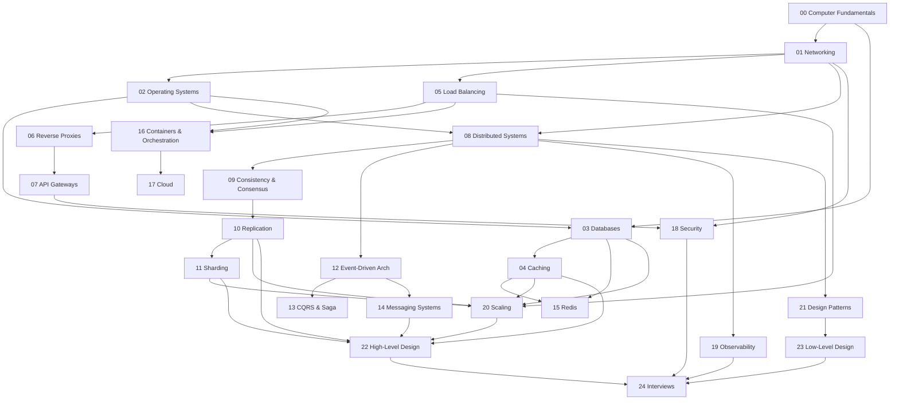

# System Design Handbook — Repository Blueprint

This document is the architectural plan for the entire handbook: folder structure, file manifest, dependency graph, learning order, and delivery milestones. It is the source of truth for *what* gets written and *in what order*. Content itself lives in the numbered section folders.

---

## Design rules

- **One concept per file.** Every `.md` is a standalone chapter under **3,000 words**, following [`TEMPLATE.md`](TEMPLATE.md).
- **Numbered prefixes** (`00-`, `01-`) encode intra-section reading order; sections are numbered `00`–`24`.
- **Each section has a `README.md`** acting as that section's index + a one-paragraph map.
- **Modular.** A file may *recommend* prerequisites but must remain self-contained. The dependency graph below is guidance for learners, not a hard coupling between files.
- **Self-contained.** No chapter assumes another was read first. Define acronyms on first use.

---

## Top-level layout

```
system-design-handbook/
├── README.md              # master TOC
├── TEMPLATE.md            # chapter template
├── CONTRIBUTING.md        # contribution guide
├── LICENSE                # CC BY-SA 4.0 (prose) + MIT (code snippets)
├── GLOSSARY.md            # one-line definitions, cross-linked
├── ROADMAP.md             # this blueprint
├── assets/diagrams/       # shared image/mermaid source assets
│
├── 00-computer-fundamentals/
├── 01-networking/
├── 02-operating-systems/
├── 03-databases/
├── 04-caching/
├── 05-load-balancing/
├── 06-reverse-proxies/
├── 07-api-gateways/
├── 08-distributed-systems/
├── 09-consistency-and-consensus/
├── 10-replication/
├── 11-sharding/
├── 12-event-driven-architecture/
├── 13-cqrs-and-saga/
├── 14-messaging-systems/
├── 15-redis/
├── 16-containers-and-orchestration/
├── 17-cloud/
├── 18-security/
├── 19-observability/
├── 20-scaling/
├── 21-design-patterns/
├── 22-high-level-design/
├── 23-low-level-design/
└── 24-interviews/
```

---

## Full file manifest

### Part I — Foundations

```
00-computer-fundamentals/
├── README.md
├── 00-how-computers-execute-programs.md
├── 01-memory-hierarchy.md
├── 02-cpu-cache-and-locality.md
├── 03-concurrency-vs-parallelism.md
├── 04-data-encoding-and-serialization.md
├── 05-latency-numbers-every-engineer-should-know.md
└── 06-complexity-analysis-for-systems.md

01-networking/
├── README.md
├── 00-osi-and-tcp-ip-models.md
├── 01-ip-addressing-and-subnets.md
├── 02-tcp-vs-udp.md
├── 03-dns.md
├── 04-http-1-and-http-2.md
├── 05-http-3-and-quic.md
├── 06-tls-and-https.md
├── 07-websockets.md
├── 08-grpc-and-protobuf.md
├── 09-rest-vs-rpc-vs-graphql.md
└── 10-latency-bandwidth-throughput.md

02-operating-systems/
├── README.md
├── 00-processes-and-threads.md
├── 01-cpu-scheduling.md
├── 02-context-switching.md
├── 03-virtual-memory-and-paging.md
├── 04-file-systems.md
├── 05-io-models.md
├── 06-epoll-kqueue-io-uring.md
└── 07-system-calls.md
```

### Part II — Storage & Data

```
03-databases/
├── README.md
├── 00-relational-vs-nosql.md
├── 01-acid-transactions.md
├── 02-transaction-isolation-levels.md
├── 03-indexing.md
├── 04-b-tree-vs-lsm-tree.md
├── 05-query-execution-and-planning.md
├── 06-normalization-and-denormalization.md
├── 07-nosql-data-models.md
├── 08-connection-pooling.md
└── 09-storage-engines.md

04-caching/
├── README.md
├── 00-caching-fundamentals.md
├── 01-cache-strategies.md
├── 02-eviction-policies.md
├── 03-cache-invalidation.md
├── 04-distributed-caching.md
├── 05-cdn.md
└── 06-caching-pitfalls.md          # stampede, penetration, thundering herd

10-replication/
├── README.md
├── 00-replication-fundamentals.md
├── 01-leader-follower.md
├── 02-multi-leader.md
├── 03-leaderless-replication.md
├── 04-sync-vs-async-replication.md
└── 05-replication-lag-and-read-your-writes.md

11-sharding/
├── README.md
├── 00-partitioning-fundamentals.md
├── 01-partitioning-strategies.md
├── 02-consistent-hashing.md
├── 03-rebalancing.md
├── 04-hotspots-and-skew.md
└── 05-cross-shard-queries.md
```

### Part III — Traffic & Edge

```
05-load-balancing/
├── README.md
├── 00-load-balancing-fundamentals.md
├── 01-l4-vs-l7.md
├── 02-load-balancing-algorithms.md
├── 03-health-checks.md
├── 04-sticky-sessions.md
└── 05-global-server-load-balancing.md

06-reverse-proxies/
├── README.md
├── 00-forward-vs-reverse-proxy.md
├── 01-reverse-proxy-use-cases.md
├── 02-nginx-envoy-haproxy.md
├── 03-tls-termination.md
└── 04-proxy-vs-load-balancer.md

07-api-gateways/
├── README.md
├── 00-api-gateway-fundamentals.md
├── 01-routing-and-composition.md
├── 02-authn-authz-at-the-gateway.md
├── 03-rate-limiting-and-throttling.md
├── 04-backend-for-frontend.md
└── 05-gateway-vs-service-mesh.md
```

### Part IV — Distributed Systems

```
08-distributed-systems/
├── README.md
├── 00-why-distributed-systems.md
├── 01-fallacies-of-distributed-computing.md
├── 02-failure-modes.md
├── 03-time-clocks-and-ordering.md
├── 04-idempotency.md
├── 05-consensus-paxos-raft.md
├── 06-leader-election.md
├── 07-distributed-locks.md
└── 08-gossip-and-failure-detection.md

09-consistency-and-consensus/
├── README.md
├── 00-consistency-models.md
├── 01-cap-theorem.md          # ✅ written (reference-quality chapter)
├── 02-pacelc.md
├── 03-quorums.md
├── 04-eventual-consistency.md
└── 05-linearizability-vs-serializability.md

12-event-driven-architecture/
├── README.md
├── 00-event-driven-fundamentals.md
├── 01-events-vs-commands.md
├── 02-pub-sub.md
├── 03-event-sourcing.md
├── 04-choreography-vs-orchestration.md
└── 05-outbox-pattern.md

13-cqrs-and-saga/
├── README.md
├── 00-cqrs.md
├── 01-saga-pattern.md
├── 02-compensating-transactions.md
└── 03-two-phase-commit-vs-saga.md

14-messaging-systems/
├── README.md
├── 00-message-queues-vs-logs.md
├── 01-delivery-guarantees.md
├── 02-kafka-architecture.md
├── 03-kafka-patterns.md
├── 04-rabbitmq-architecture.md
├── 05-rabbitmq-patterns.md
├── 06-backpressure-and-flow-control.md
└── 07-dead-letter-queues.md

15-redis/
├── README.md
├── 00-redis-fundamentals.md
├── 01-redis-data-structures.md
├── 02-persistence-rdb-aof.md
├── 03-redis-as-cache-vs-database.md
├── 04-redis-cluster-and-replication.md
└── 05-redis-patterns.md
```

### Part V — Infrastructure & Operations

```
16-containers-and-orchestration/
├── README.md
├── 00-containers-vs-vms.md
├── 01-docker-fundamentals.md
├── 02-docker-internals.md          # namespaces, cgroups
├── 03-container-networking-and-storage.md
├── 04-kubernetes-architecture.md
├── 05-kubernetes-workloads.md
├── 06-kubernetes-networking.md
└── 07-autoscaling.md

17-cloud/
├── README.md
├── 00-cloud-fundamentals.md        # IaaS/PaaS/SaaS
├── 01-regions-and-availability-zones.md
├── 02-compute-options.md
├── 03-object-storage.md
├── 04-serverless-and-faas.md
├── 05-managed-databases.md
├── 06-multi-region-and-multi-cloud.md
└── 07-cost-and-capacity.md

18-security/
├── README.md
├── 00-security-fundamentals.md
├── 01-authentication-vs-authorization.md
├── 02-oauth2-and-oidc.md
├── 03-jwt-and-sessions.md
├── 04-encryption-in-transit-and-at-rest.md
├── 05-common-attacks.md
├── 06-secrets-management.md
└── 07-rate-limiting-and-ddos-protection.md

19-observability/
├── README.md
├── 00-observability-fundamentals.md
├── 01-metrics.md
├── 02-logging.md
├── 03-distributed-tracing.md
├── 04-sli-slo-sla.md
├── 05-alerting-and-on-call.md
└── 06-health-checks-and-heartbeats.md

20-scaling/
├── README.md
├── 00-scaling-fundamentals.md      # vertical vs horizontal
├── 01-stateless-design.md
├── 02-back-of-the-envelope-estimation.md
├── 03-capacity-planning.md
├── 04-read-vs-write-scaling.md
├── 05-rate-limiting-algorithms.md
└── 06-handling-traffic-spikes.md
```

### Part VI — Design Craft

```
21-design-patterns/
├── README.md
├── 00-design-patterns-overview.md
├── 01-creational-patterns.md
├── 02-structural-patterns.md
├── 03-behavioral-patterns.md
├── 04-resilience-patterns.md       # circuit breaker, bulkhead, retry/backoff, timeout
├── 05-messaging-patterns.md
└── 06-data-management-patterns.md

22-high-level-design/
├── README.md
├── 00-hld-process.md
├── 01-requirements-gathering.md
├── 02-capacity-estimation.md
├── 03-api-design.md
├── 04-data-modeling.md
├── 05-architecture-and-components.md
└── 06-tradeoff-analysis.md

23-low-level-design/
├── README.md
├── 00-lld-fundamentals.md
├── 01-solid-principles.md
├── 02-object-oriented-design.md
├── 03-designing-for-testability.md
├── 04-concurrency-safe-components.md
└── 05-uml-and-diagramming.md

24-interviews/
├── README.md
├── 00-interview-framework.md
├── 01-driving-the-conversation.md
├── 02-evaluation-rubric.md
└── worked-examples/
    ├── 00-url-shortener.md
    ├── 01-rate-limiter.md
    ├── 02-news-feed.md
    ├── 03-chat-system.md
    ├── 04-typeahead-autocomplete.md
    ├── 05-web-crawler.md
    ├── 06-distributed-cache.md
    ├── 07-notification-system.md
    ├── 08-ride-sharing.md
    ├── 09-video-streaming.md
    └── 10-payment-system.md
```

**Totals:** 25 section folders (incl. interviews subfolder) · ~150 chapter files + 25 section READMEs + 6 top-level files.

---

## Dependency graph (section level)



Arrows mean "is a recommended prerequisite for." The graph converges on HLD/LLD, which feed the Interviews capstone. Edge sections (Cloud, Security, Observability, Redis) hang off their natural parents but are not on the critical path.

---

## Learning order (linear path through the DAG)

A topological ordering for a beginner reading start to finish:

1. **00** Computer Fundamentals
2. **01** Networking
3. **02** Operating Systems
4. **03** Databases
5. **04** Caching
6. **05** Load Balancing → **06** Reverse Proxies → **07** API Gateways
7. **08** Distributed Systems
8. **09** Consistency & Consensus
9. **10** Replication → **11** Sharding
10. **20** Scaling *(pulls together DB + cache + replication + sharding + LB)*
11. **12** Event-Driven Architecture → **13** CQRS & Saga → **14** Messaging Systems
12. **15** Redis
13. **16** Containers & Orchestration → **17** Cloud
14. **18** Security
15. **19** Observability
16. **21** Design Patterns
17. **23** Low-Level Design
18. **22** High-Level Design
19. **24** Interviews *(capstone — applies everything)*

### Fast tracks

- **Interview crash course:** 20 → 04 → 10 → 11 → 14 → 09 → 22 → 24
- **Backend engineer:** 01 → 03 → 04 → 05 → 08 → 14 → 18 → 19
- **Infra / platform:** 02 → 16 → 17 → 05 → 19 → 18

---

## Milestones

| Milestone | Scope | Sections | Outcome |
|-----------|-------|----------|---------|
| **M0 — Scaffold** ✅ | Repo skeleton, template, license, contributing, this roadmap, GLOSSARY stub | top-level | Done. CAP chapter written as the quality reference. |
| **M1 — Foundations** | Everything a reader needs before distributed topics | 00, 01, 02 | A beginner can read the whole "how machines + networks work" base |
| **M2 — Storage & Data** | Data layer mastery | 03, 04, 10, 11 | Reader can reason about databases, caching, replication, sharding |
| **M3 — Traffic & Edge** | Request path | 05, 06, 07 | Reader understands how requests reach services |
| **M4 — Distributed Core** | The theory spine | 08, 09 (finish), 20 | Reader can reason about failures, consistency, and scaling |
| **M5 — Async & Eventing** | Decoupled architectures | 12, 13, 14, 15 | Reader can design event-driven + messaging systems |
| **M6 — Infra & Ops** | Run it in production | 16, 17, 18, 19 | Reader understands deployment, cloud, security, observability |
| **M7 — Design Craft** | Synthesis | 21, 22, 23 | Reader can structure their own designs |
| **M8 — Interviews (Capstone)** | Applied practice | 24 + worked examples | Reader can perform in a real interview |
| **M9 — Polish** | Cross-links, GLOSSARY fill, diagram pass, status table | all | v1.0 release |

---

## Progress tracker

| Status | Meaning |
|--------|---------|
| ✅ | Written and reviewed |
| 🚧 | In progress |
| ⬜ | Not started |

Update this as chapters land. Current state:

- **M0 Scaffold** — ✅
- `09-consistency-and-consensus/01-cap-theorem.md` — ✅
- Everything else — ⬜
